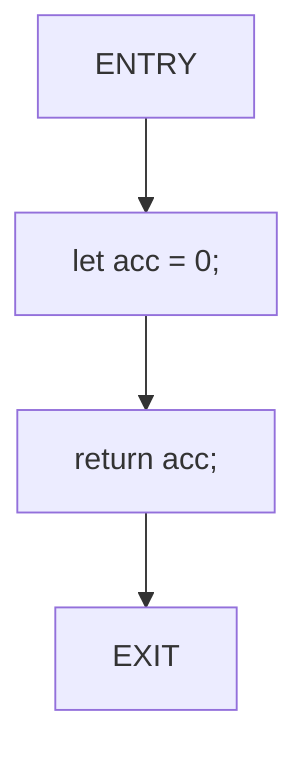

# ntree

A minimal Tree-sitter based library for parsing and analyzing Rust source code, including Control Flow Graph generation.

## Installation

Add to your `Cargo.toml`:

```toml
[dependencies]
ntree = "0.1.0"
```

## Features

- Parse Rust files using Tree-sitter
- Extract top-level items (functions, structs, enums, etc.)
- Extract functions with their body spans
- Generate Control Flow Graphs (CFG) for functions
- Output in JSONL and Mermaid diagram formats

## API Usage

### Parse a Rust file

```rust
use ntree::create_tree_from_file;

let root_node = create_tree_from_file("src/main.rs")?;
println!("Root node kind: {}", root_node.kind());
```

### List top-level items

Extract all top-level declarations from a Rust file:

```rust
use ntree::{list_top_level_items, items_to_jsonl};

let items = list_top_level_items("src/lib.rs")?;
let jsonl = items_to_jsonl(&items);
println!("{}", jsonl);
```

Output (JSONL format, one JSON object per line):
```json
{"file":"src/lib.rs","kind":"use_declaration","identifier":null,"start_line":1,"start_column":1,"end_line":1,"end_column":31}
{"file":"src/lib.rs","kind":"function_item","identifier":"process_data","start_line":3,"start_column":1,"end_line":5,"end_column":2}
{"file":"src/lib.rs","kind":"struct_item","identifier":"DataProcessor","start_line":7,"start_column":1,"end_line":9,"end_column":2}
```

### Extract functions with body spans

Get all functions with their full spans and body spans:

```rust
use ntree::{list_functions, functions_to_jsonl};

let functions = list_functions("src/main.rs")?;
let jsonl = functions_to_jsonl(&functions);
println!("{}", jsonl);
```

Output (JSONL format):
```json
{"function":"calculate","span":"2:1–6:2","body":"2:37–6:2"}
{"function":"check","span":"8:1–20:2","body":"8:35–20:2"}
```

Note: Coordinates are 1-based in output for human readability. The body span includes the opening and closing braces.

### Generate Control Flow Graphs (CFG)

Generate linear Control Flow Graphs for all functions in a file:

```rust
use ntree::generate_cfgs;

let cfgs = generate_cfgs("src/main.rs")?;

for cfg_result in cfgs {
    println!("Function: {}", cfg_result.function_name);

    // Get Mermaid diagram
    println!("Mermaid diagram:\n{}", cfg_result.mermaid);

    // Get JSONL representation
    println!("JSONL:\n{}", cfg_result.jsonl);
}
```

Example function:
```rust
fn calculate() {
    let acc = 0;
    return acc;
}
```

Generates JSONL output:
```json
{"cfg_node":0,"label":"ENTRY"}
{"cfg_node":1,"label":"let acc = 0;"}
{"cfg_node":2,"label":"return acc;"}
{"cfg_node":3,"label":"EXIT"}
{"cfg_edge":{"from":0,"to":1,"kind":"next"}}
{"cfg_edge":{"from":1,"to":2,"kind":"next"}}
{"cfg_edge":{"from":2,"to":3,"kind":"next"}}
```

And Mermaid diagram:


## API Reference

### Core Module (`ntree::core`)

- `create_tree_from_file(path)` - Parse a Rust file and return the root Tree-sitter node
- `read_file(path)` - Read a file's contents
- `NTreeError` - Error type for all operations

### API Module (`ntree::api`)

#### Top-level Items
- `list_top_level_items(path)` - Extract all top-level declarations from a file
- `items_to_jsonl(items)` - Convert top-level items to JSONL format

#### Functions
- `list_functions(path)` - Extract all functions with their spans and body spans
- `functions_to_jsonl(functions)` - Convert function spans to JSONL format

#### Control Flow Graphs
- `generate_cfgs(path)` - Generate CFGs for all functions in a file
- `CfgResult` - Contains both Mermaid and JSONL representations of a CFG

### Models Module (`ntree::models`)

- `TopLevelItem` - Represents a top-level declaration with position information
- `FunctionSpan` - Represents a function with full span and body span
- `CfgNode` - Represents a node in a Control Flow Graph
- `CfgEdge` - Represents an edge in a Control Flow Graph
- `ControlFlowGraph` - Complete CFG with nodes and edges

## Coordinate System

- **Internal representation**: 0-based (row and column start at 0)
- **Output format**: 1-based (row and column start at 1)
- **Span format**: `row:column–row:column` (e.g., `2:1–6:2`)

## Edge Cases Handled

- Functions with attributes (`#[test]`, `#[derive]`, etc.)
- Functions with where clauses
- Async, const, and unsafe functions
- Functions with braces on new lines
- Empty function bodies

## Error Handling

All functions return `Result<T, NTreeError>` where `NTreeError` can be:
- `IoError` - File reading errors
- `ParseError` - Parsing or language setup errors

Example error handling:
```rust
use ntree::list_functions;

match list_functions("src/main.rs") {
    Ok(functions) => {
        for func in functions {
            println!("Found function: {}", func.function);
        }
    }
    Err(e) => eprintln!("Error: {}", e),
}
```

## License

MIT